# MainAgent Architecture & Flow Documentation

## Overview

MainAgent is a research assistant that intelligently combines web search and Retrieval-Augmented Generation (RAG) to answer user questions. Built with **PocketFlow** for orchestration, **FastAPI** for the backend, and **Next.js** for the frontend, it provides a seamless conversational experience.

---

## System Architecture

```mermaid
graph TB
    subgraph "Frontend Layer"
        UI[Next.js UI<br/>Port 3000]
    end
    
    subgraph "Backend Layer"
        API[FastAPI Server<br/>Port 8000]
        Flow[PocketFlow Engine]
    end
    
    subgraph "Agent Nodes"
        Decide[🤔 DecideActionNode]
        Search[🔍 SearchWebNode]
        Embed[🧮 EmbedQueryNode]
        Retrieve[📚 RetrieveRAGNode]
        Answer[✍️ AnswerNode]
    end
    
    subgraph "External Services"
        OpenAI[OpenAI API<br/>LLM & Embeddings]
        DuckDuckGo[DuckDuckGo<br/>Web Search]
        FAISS[FAISS Vector Store<br/>Local RAG Index]
    end
    
    UI -->|POST /api/chat| API
    API -->|Run Flow| Flow
    Flow --> Decide
    
    Decide --> Search
    Decide --> Embed
    Decide --> Answer
    
    Search --> DuckDuckGo
    Embed --> OpenAI
    Retrieve --> FAISS
    Answer --> OpenAI
    
    API -->|Response| UI
```



---

## Agent Flow Logic

The MainAgent uses a **decision-based routing system** where the `DecideActionNode` acts as an intelligent orchestrator, determining the best path to answer each question.

```mermaid
flowchart TD
    Start([User Question]) --> Decide{🤔 DecideActionNode<br/>Analyze Question}
    
    Decide -->|Need more context| Search[🔍 SearchWebNode<br/>Web Search]
    Decide -->|Use knowledge base| Embed[🧮 EmbedQueryNode<br/>Generate Embedding]
    Decide -->|Can answer directly| Answer[✍️ AnswerNode<br/>Synthesize Response]
    
    Search -->|Add context| Decide
    
    Embed --> Retrieve[📚 RetrieveRAGNode<br/>Query FAISS Index]
    Retrieve -->|Retrieved docs| Answer
    
    Answer --> End([Return Answer])
    
    style Decide fill:#ffd700,stroke:#333,stroke-width:3px
    style Search fill:#87ceeb,stroke:#333,stroke-width:2px
    style Embed fill:#98fb98,stroke:#333,stroke-width:2px
    style Retrieve fill:#dda0dd,stroke:#333,stroke-width:2px
    style Answer fill:#ffa07a,stroke:#333,stroke-width:2px
```



---

## Node Descriptions

### 🤔 DecideActionNode
**Purpose**: Intelligent routing and decision-making

**Actions**:
- Analyzes the user's question
- Evaluates existing context and RAG results
- Decides next action: `search`, `rag`, or `answer`

**Returns**:
- `search`: Needs web search for current information
- `rag`: Should query the knowledge base
- `answer`: Has enough information to respond

**Key Logic**:
```python
# Evaluates:
- Question complexity
- Available context
- RAG results quality
- Need for external data
```

---

### 🔍 SearchWebNode
**Purpose**: Gather real-time information from the web

**Process**:
1. Receives search query from DecideActionNode
2. Executes DuckDuckGo search
3. Extracts titles, URLs, and snippets
4. Appends results to shared context
5. Returns to DecideActionNode for re-evaluation

**Metrics Tracked**:
- `search_count`: Number of searches performed

---

### 🧮 EmbedQueryNode
**Purpose**: Convert text to vector embeddings

**Process**:
1. Receives user question
2. Calls OpenAI embeddings API
3. Generates vector representation
4. Stores embedding in shared state

**Used For**:
- Semantic similarity search in FAISS
- Finding relevant documents in knowledge base

---

### 📚 RetrieveRAGNode
**Purpose**: Query local knowledge base

**Process**:
1. Receives query embedding
2. Searches FAISS vector index
3. Retrieves top-k (default: 3) most similar documents
4. Returns document chunks with sources

**Metrics Tracked**:
- `rag_hits`: Number of documents retrieved

---

### ✍️ AnswerNode
**Purpose**: Synthesize final answer using LLM

**Process**:
1. Receives question, context, and RAG results
2. Constructs comprehensive prompt
3. Calls OpenAI LLM
4. Generates answer with source citations
5. Returns final response to user

**Output Format**:
- Concise answer
- Inline source citations
- Acknowledgment of uncertainty when applicable

---

## Request Flow Sequence


---

## Data Flow & Shared State

Throughout the flow execution, nodes communicate via a **shared state dictionary**:

```python
shared = {
    "question": str,           # Original user question
    "context": str,            # Accumulated web search context
    "search_history": list,    # History of search results
    "search_query": str,       # Current search query
    "query_embedding": list,   # Vector embedding of question
    "rag_results": list,       # Retrieved documents from FAISS
    "answer": str,             # Final answer
    "metrics": {
        "search_count": int,   # Number of searches performed
        "rag_hits": int        # Number of RAG documents retrieved
    }
}
```

---

## API Endpoints

### `POST /api/chat`
**Request**:
```json
{
  "message": "What is machine learning?",
  "session_id": "optional-session-id"
}
```

**Response**:
```json
{
  "answer": "Machine learning is...",
  "sources": ["source1.txt", "source2.pdf"],
  "trace_id": "uuid-v4"
}
```

### `GET /api/evals`
**Response**:
```json
{
  "recent": [
    {
      "session_id": "user-123",
      "latency_ms": 1234.56,
      "searches": 2,
      "rag_hits": 3
    }
  ]
}
```

### `GET /health`
**Response**:
```json
{
  "status": "ok"
}
```

---

## Decision Logic Examples


---

## Technology Stack

| Layer | Technology | Purpose |
|-------|-----------|---------|
| **Frontend** | Next.js 14 | React-based UI framework |
| **Backend** | FastAPI | High-performance Python API |
| **Orchestration** | PocketFlow | Node-based workflow engine |
| **LLM** | OpenAI GPT | Language understanding & generation |
| **Embeddings** | OpenAI text-embedding | Vector generation |
| **Search** | DuckDuckGo | Web search without API key |
| **Vector Store** | FAISS | Efficient similarity search |
| **Environment** | python-dotenv | Configuration management |

---

## Configuration

### Environment Variables
```bash
OPENAI_API_KEY=sk-...              # Required: OpenAI API key
SEARCH_API_KEY=optional            # Optional: Alternative search API
RAG_INDEX_PATH=backend/data/index.faiss  # FAISS index location
RAG_STORE_PATH=backend/data/store.pkl    # Document metadata store
BACKEND_URL=http://localhost:8000        # Backend API URL
FRONTEND_URL=http://localhost:3000       # Frontend URL
NEXT_PUBLIC_BACKEND_URL=http://localhost:8000  # Frontend env
```

---

## Running the Application

### Backend
```bash
cd backend
pip install -r requirements.txt
python3 -m uvicorn main:app --reload --host 0.0.0.0 --port 8000
```

### Frontend
```bash
cd frontend
npm install
npm run dev
```

### Access Points
- **Frontend UI**: http://localhost:3000
- **API Docs**: http://localhost:8000/docs
- **Health Check**: http://localhost:8000/health

---

## Monitoring & Debugging

### Terminal Output
Each node prints emoji-decorated logs showing execution flow:
```
🤔 DecideActionNode: Analyzing question and deciding next action (search/RAG/answer)
🔍 SearchWebNode: Performing web search for query: 'latest AI news'
🧮 EmbedQueryNode: Generating embedding vector for question
📚 RetrieveRAGNode: Searching FAISS index for relevant document chunks
✍️ AnswerNode: Synthesizing final answer using LLM with context and RAG results
```

### Metrics Collection
The `/api/evals` endpoint provides real-time metrics:
- Request latency
- Search count per request
- RAG hits per request
- Session tracking

---

## Extension Points

### Adding New Nodes
1. Create node class inheriting from `pocketflow.Node`
2. Implement `prep()`, `exec()`, and `post()` methods
3. Wire into flow in `flow.py`
4. Add emoji print statement for monitoring

### Custom Decision Logic
Modify `DecideActionNode.exec()` to implement custom routing:
- Add new action types
- Implement multi-step reasoning
- Add confidence thresholds

### Alternative Data Sources
- Replace DuckDuckGo with Google/Bing
- Add database queries
- Integrate APIs (weather, stocks, etc.)

---

## Performance Considerations

- **Caching**: Consider caching embeddings for repeated questions
- **Async Operations**: Search and embedding calls could be parallelized
- **Rate Limiting**: Implement rate limits for OpenAI API calls
- **Vector Index**: FAISS index size impacts retrieval speed
- **Context Window**: Monitor token usage in LLM calls

---

## Future Enhancements

- [ ] Multi-turn conversation support
- [ ] Streaming responses
- [ ] Custom RAG document upload
- [ ] Advanced search filters
- [ ] Response quality scoring
- [ ] A/B testing different prompts
- [ ] User feedback collection
- [ ] Cost tracking per request

---

## Troubleshooting

### Common Issues

**"OPENAI_API_KEY is not set"**
- Ensure `.env` file exists in `backend/` directory
- Restart the backend server after adding `.env`

**"Module not found" errors**
- Run `pip install -r requirements.txt` in backend
- Run `npm install` in frontend

**FAISS index not found**
- Create `backend/data/` directory
- Initialize FAISS index or remove RAG path from `.env`

**CORS errors**
- Check `NEXT_PUBLIC_BACKEND_URL` in frontend `.env`
- Verify CORS middleware in `main.py`

---

## License & Credits

Built with:
- [PocketFlow](https://github.com/the-pocket/pocketflow) - Workflow orchestration
- [FastAPI](https://fastapi.tiangolo.com/) - Backend framework
- [Next.js](https://nextjs.org/) - Frontend framework
- [OpenAI](https://openai.com/) - LLM & Embeddings
- [FAISS](https://github.com/facebookresearch/faiss) - Vector similarity search
