# Architecture & Agent Documentation

## Overview

MainAgent is a research assistant that intelligently combines web search and Retrieval-Augmented Generation (RAG) to answer user questions. Built with **PocketFlow** for orchestration, **FastAPI** for the backend, and **Next.js** for the frontend, it provides a seamless conversational experience.

---

## System Architecture

```mermaid
graph TB
    subgraph "Frontend Layer"
        UI[Next.js UI<br/>Port 3000]
    end
    
    subgraph "Backend Layer"
        API[FastAPI Server<br/>Port 8000]
        Orchestration[Orchestration Engine]
    end
    
    subgraph "Agent"
        Decide[🤔 DecideActionNode]
        Search[🔍 SearchWebNode]
        Embed[🧮 EmbedQueryNode]
        Retrieve[📚 RetrieveRAGNode]
        ExecuteTool[🛠️ ExecuteMCPToolNode]
        Answer[✍️ AnswerNode]
    end
    
    subgraph "External Services"
        OpenAI[OpenAI API<br/>LLM & Embeddings]
        DuckDuckGo[DuckDuckGo<br/>Web Search]
        Pinecone[Pinecone<br/>Cloud Vector DB]
    end
    
    subgraph "MCP Servers"
        Weather[Apify Weather<br/>HTTP/SSE]
        Langfuse[Langfuse Prompts<br/>HTTP/SSE]
    end
    
    UI -->|POST /api/chat| API
    API -->|Run Orchestration| Orchestration
    Orchestration --> Decide
    
    Decide --> Search
    Decide --> Embed
    Decide --> ExecuteTool
    Decide --> Answer
    Decide --> Retrieve
    
    Search --> DuckDuckGo
    Embed --> OpenAI
    Retrieve --> Pinecone
    ExecuteTool --> Weather
    ExecuteTool --> Langfuse
    Answer --> OpenAI
    
    API -->|Response| UI
```



---

## Agent Graph 

The MainAgent uses a **decision-based routing system** where the `DecideActionNode` acts as an intelligent orchestrator, determining the best path to answer each question.

```mermaid
flowchart TD
    Start([User Question]) --> Decide{🤔 DecideActionNode}
    
    Decide -->|Need weather| Tool[🛠️ ExecuteMCPToolNode]
    Decide -->|Need prompts| Tool
    Decide -->|Need search| Search[🔍 SearchWebNode]
    Decide -->|Need RAG| Embed[🧮 EmbedQueryNode]
    Decide -->|Can answer| Answer[✍️ AnswerNode]
    
    Tool -->|Add context| Decide
    Search -->|Add context| Decide
    Embed --> Retrieve[📚 RetrieveRAGNode]
    Retrieve --> Answer
    
    Answer --> End([Return Answer])
```



---

## Node Descriptions

### 🤔 DecideActionNode
**Purpose**: Intelligent routing and decision-making

**Actions**:
- Analyzes the user's question
- Evaluates existing context and RAG results
- Discovers available MCP tools
- Decides next action: `search`, `rag`, `tool`, or `answer`

**Returns**:
- `search`: Needs web search for current information
- `rag`: Should query the knowledge base
- `tool`: Should use an external MCP tool
- `answer`: Has enough information to respond

**Key Logic**:
```python
# Evaluates:
- Question complexity
- Available context
- RAG results quality
- Available MCP tools
- Need for external data or specialized tools
```

---

### 🔍 SearchWebNode
**Purpose**: Gather real-time information from the web

**Process**:
1. Receives search query from DecideActionNode
2. Executes DuckDuckGo search
3. Extracts titles, URLs, and snippets
4. Appends results to shared context
5. Returns to DecideActionNode for re-evaluation

**Metrics Tracked**:
- `search_count`: Number of searches performed

---

### 🧮 EmbedQueryNode
**Purpose**: Convert text to vector embeddings

**Process**:
1. Receives user question
2. Calls OpenAI embeddings API
3. Generates vector representation
4. Stores embedding in shared state

**Used For**:
- Semantic similarity search in FAISS
- Finding relevant documents in knowledge base

---

### 📚 RetrieveRAGNode
**Purpose**: Query cloud-based knowledge base

**Process**:
1. Receives query embedding
2. Searches Pinecone vector index
3. Retrieves top-k (default: 3) most similar documents
4. Returns document chunks with sources

**Metrics Tracked**:
- `rag_hits`: Number of documents retrieved

---

### 🛠️ ExecuteMCPToolNode
**Purpose**: Execute external tools via Model Context Protocol

**Process**:
1. Receives tool name and arguments from DecideActionNode
2. Routes request to appropriate MCP server (Weather, Langfuse, etc.)
3. Executes tool via HTTP/SSE connection
4. Returns result to shared context
5. Returns to DecideActionNode for re-evaluation

**Supported MCP Servers**:
- **Apify Weather**: Weather data, timezone information
- **Langfuse**: Prompt management, observability data

**Tool Naming Convention**:
- Tools are prefixed with server name: `weather_get_weather`, `langfuse_list_prompts`
- Automatic routing based on prefix

**Example Tools**:
```python
# Weather tools
weather_get_weather(city="Paris")
weather_get_current_datetime(timezone="Europe/Paris")

# Langfuse tools
langfuse_list_prompts()
langfuse_get_prompt(name="greeting")
```

---

### ✍️ AnswerNode
**Purpose**: Synthesize final answer using LLM

**Process**:
1. Receives question, context, and RAG results
2. Constructs comprehensive prompt
3. Calls OpenAI LLM
4. Generates answer with source citations
5. Returns final response to user

**Output Format**:
- Concise answer
- Inline source citations
- Acknowledgment of uncertainty when applicable

---
### MCP Integration 


### Supported MCP Servers

#### 1. Apify Weather Server
**URL**: `https://jiri-spilka--weather-mcp-server.apify.actor/mcp`

**Tools**:
- `weather_get_weather` - Current weather for any city
- `weather_get_weather_by_datetime_range` - Historical weather data
- `weather_get_current_datetime` - Current time for any timezone

**Configuration**:
```bash
APIFY_API_TOKEN=apify_api_your_token_here
```

#### 2. Langfuse MCP Server
**URL**: `{LANGFUSE_HOST}/api/public/mcp`

**Tools** (Prompt Management & Observability):
- `langfuse_list_prompts` - List all prompts
- `langfuse_get_prompt` - Get a specific prompt
- `langfuse_compile_prompt` - Compile prompt with variables
- `langfuse_create_prompt` - Create new prompt
- And more...

### How It Works

1. **Tool Discovery**: On startup, `DecideActionNode` queries all configured MCP servers
2. **Tool Naming**: Tools are prefixed with server name (e.g., `weather_get_weather`)
3. **Routing**: `ExecuteMCPToolNode` routes tool calls to the appropriate server
4. **Dynamic**: Servers can be enabled/disabled by adding/removing credentials

### Example Questions

With MCP servers configured:
- "What's the weather in Paris?" → Uses `weather_get_weather`
- "What time is it in Tokyo?" → Uses `weather_get_current_datetime`
- "List my prompts" → Uses `langfuse_list_prompts`
- "Get the customer_greeting prompt" → Uses `langfuse_get_prompt`

---

## Session Memory

Throughout the flow execution, collect user inputs and on going context in the **Session Memory**:

```python
shared = {
    "question": str,           # Original user question
    "context": str,            # Accumulated web search context
    "search_history": list,    # History of search results
    "search_query": str,       # Current search query
    "query_embedding": list,   # Vector embedding of question
    "rag_results": list,       # Retrieved documents from Pinecone
    "tool_name": str,          # MCP tool to execute
    "tool_args": dict,         # Arguments for MCP tool
    "answer": str,             # Final answer
    "metrics": {
        "search_count": int,   # Number of searches performed
        "rag_hits": int,       # Number of RAG documents retrieved
        "tool_calls": int      # Number of MCP tool calls
    }
}
```
---

## Request Flow Sequence


---

## API Endpoints

### `POST /api/chat`
**Request**:
```json
{
  "message": "What is machine learning?",
  "session_id": "optional-session-id"
}
```

**Response**:
```json
{
  "answer": "Machine learning is...",
  "sources": ["source1.txt", "source2.pdf"],
  "trace_id": "uuid-v4"
}
```

### `GET /api/evals`
**Response**:
```json
{
  "recent": [
    {
      "session_id": "user-123",
      "latency_ms": 1234.56,
      "searches": 2,
      "rag_hits": 3
    }
  ]
}
```

### `GET /health`
**Response**:
```json
{
  "status": "ok"
}
```

---


## Running the Application

### Backend
**Note**: Python 3.10+ is required for MCP support

```bash
cd backend
pip3 install -r requirements.txt

# For MCP support, use Python 3.10+
/opt/homebrew/bin/python3.10 -m uvicorn main:app --reload --host 0.0.0.0 --port 8000

# Or with default Python 3
python3 -m uvicorn main:app --reload --host 0.0.0.0 --port 8000
```

### Frontend
```bash
cd frontend
npm install
npm run dev
```

### Access Points
- **Frontend UI**: http://localhost:3000
- **API Docs**: http://localhost:8000/docs
- **Health Check**: http://localhost:8000/health

---

## Monitoring & Debugging

### Terminal Output
Each node prints emoji-decorated logs showing execution flow:
```
🤔 DecideActionNode: Analyzing question and deciding next action (search/RAG/answer)
🔍 SearchWebNode: Performing web search for query: 'latest AI news'
🧮 EmbedQueryNode: Generating embedding vector for question
📚 RetrieveRAGNode: Searching FAISS index for relevant document chunks
✍️ AnswerNode: Synthesizing final answer using LLM with context and RAG results
```

### Metrics Collection
The `/api/evals` endpoint provides real-time metrics:
- Request latency
- Search count per request
- RAG hits per request
- Session tracking

---


